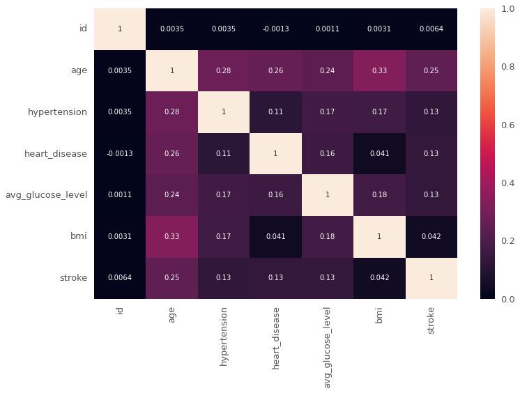
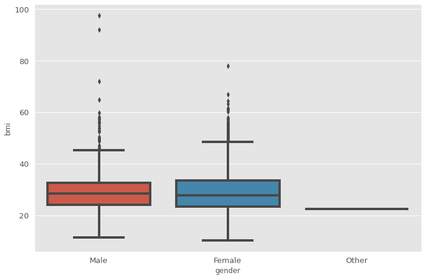
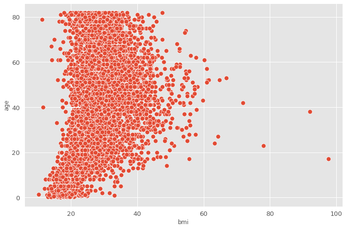
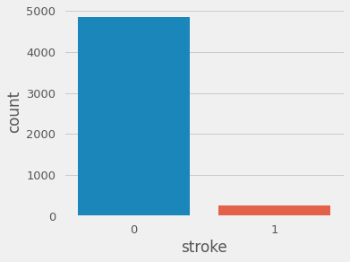
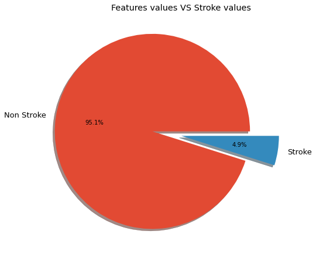
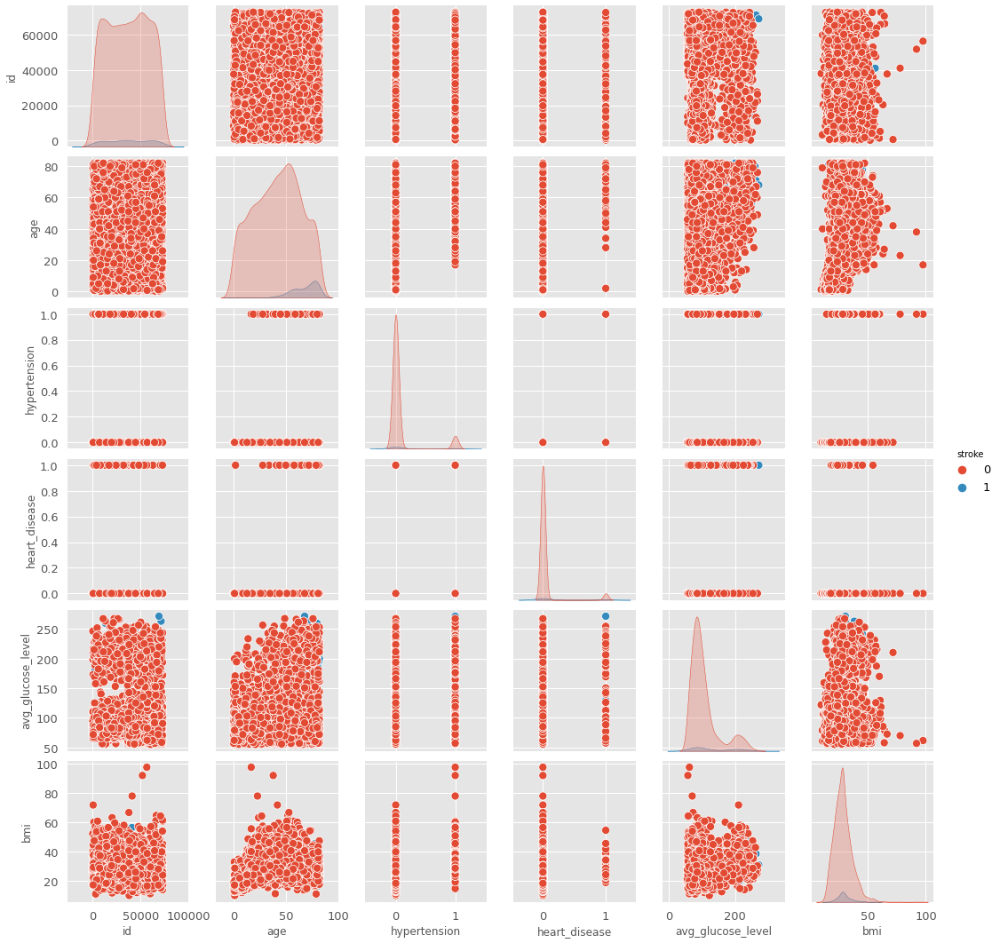
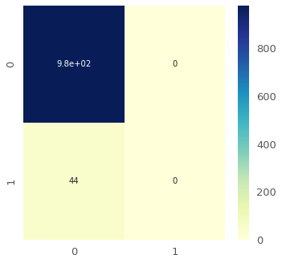

# Stroke Prediction


-According to the World Health Organization (WHO) stroke is the 2nd leading cause of death globally, responsible for approximately 11% of total deaths.
This dataset is used to predict whether a patient is likely to get stroke based on the input parameters like gender, age, various diseases, and smoking status. Each row in the data provides relavant information about the patient.

# Attribute Information
1) id: unique identifier

2) gender: "Male", "Female" or "Other"

3) age: age of the patient

4) hypertension: 0 if the patient doesn't have hypertension, 1 if the patient has hypertension

5) heart_disease: 0 if the patient doesn't have any heart diseases, 1 if the patient has a heart disease

6) ever_married: "No" or "Yes"

7) work_type: "children", "Govt_jov", "Never_worked", "Private" or "Self-employed"

8) Residence_type: "Rural" or "Urban"

9) avg_glucose_level: average glucose level in blood

10) bmi: body mass index

11) smoking_status: "formerly smoked", "never smoked", "smokes" or "Unknown"*

12) stroke: 1 if the patient had a stroke or 0 if not

# Importing necessary libraries


```python
import pandas as pd 
import matplotlib.pyplot as plt 
import numpy as np 
import seaborn as sns
import plotly.express as px
from sklearn.feature_selection import SelectKBest, chi2
from sklearn.svm import SVC
from sklearn.ensemble import RandomForestClassifier
from sklearn.linear_model import LogisticRegression
from sklearn.tree import DecisionTreeClassifier
from sklearn.model_selection import train_test_split
from sklearn.metrics import confusion_matrix
from sklearn.metrics import classification_report
import warnings
warnings.filterwarnings('ignore')
import pickle
```

# Retrieve data


```python
data=pd.read_csv("healthcare-dataset-stroke-data.csv")
data.head()
```


<div>
<style scoped>
    .dataframe tbody tr th:only-of-type {
        vertical-align: middle;
    }

    .dataframe tbody tr th {
        vertical-align: top;
    }

    .dataframe thead th {
        text-align: right;
    }
</style>
<table border="1" class="dataframe">
  <thead>
    <tr style="text-align: right;">
      <th></th>
      <th>id</th>
      <th>gender</th>
      <th>age</th>
      <th>hypertension</th>
      <th>heart_disease</th>
      <th>ever_married</th>
      <th>work_type</th>
      <th>Residence_type</th>
      <th>avg_glucose_level</th>
      <th>bmi</th>
      <th>smoking_status</th>
      <th>stroke</th>
    </tr>
  </thead>
  <tbody>
    <tr>
      <th>0</th>
      <td>9046</td>
      <td>Male</td>
      <td>67.0</td>
      <td>0</td>
      <td>1</td>
      <td>Yes</td>
      <td>Private</td>
      <td>Urban</td>
      <td>228.69</td>
      <td>36.6</td>
      <td>formerly smoked</td>
      <td>1</td>
    </tr>
    <tr>
      <th>1</th>
      <td>51676</td>
      <td>Female</td>
      <td>61.0</td>
      <td>0</td>
      <td>0</td>
      <td>Yes</td>
      <td>Self-employed</td>
      <td>Rural</td>
      <td>202.21</td>
      <td>NaN</td>
      <td>never smoked</td>
      <td>1</td>
    </tr>
    <tr>
      <th>2</th>
      <td>31112</td>
      <td>Male</td>
      <td>80.0</td>
      <td>0</td>
      <td>1</td>
      <td>Yes</td>
      <td>Private</td>
      <td>Rural</td>
      <td>105.92</td>
      <td>32.5</td>
      <td>never smoked</td>
      <td>1</td>
    </tr>
    <tr>
      <th>3</th>
      <td>60182</td>
      <td>Female</td>
      <td>49.0</td>
      <td>0</td>
      <td>0</td>
      <td>Yes</td>
      <td>Private</td>
      <td>Urban</td>
      <td>171.23</td>
      <td>34.4</td>
      <td>smokes</td>
      <td>1</td>
    </tr>
    <tr>
      <th>4</th>
      <td>1665</td>
      <td>Female</td>
      <td>79.0</td>
      <td>1</td>
      <td>0</td>
      <td>Yes</td>
      <td>Self-employed</td>
      <td>Rural</td>
      <td>174.12</td>
      <td>24.0</td>
      <td>never smoked</td>
      <td>1</td>
    </tr>
  </tbody>
</table>
</div>


# Know more about data


```python
data.info()
```

    <class 'pandas.core.frame.DataFrame'>
    RangeIndex: 5110 entries, 0 to 5109
    Data columns (total 12 columns):
     #   Column             Non-Null Count  Dtype  
    ---  ------             --------------  -----  
     0   id                 5110 non-null   int64  
     1   gender             5110 non-null   object 
     2   age                5110 non-null   float64
     3   hypertension       5110 non-null   int64  
     4   heart_disease      5110 non-null   int64  
     5   ever_married       5110 non-null   object 
     6   work_type          5110 non-null   object 
     7   Residence_type     5110 non-null   object 
     8   avg_glucose_level  5110 non-null   float64
     9   bmi                4909 non-null   float64
     10  smoking_status     5110 non-null   object 
     11  stroke             5110 non-null   int64  
    dtypes: float64(3), int64(4), object(5)
    memory usage: 479.2+ KB
    


```python
data.describe().round(1)
```


<div>
<style scoped>
    .dataframe tbody tr th:only-of-type {
        vertical-align: middle;
    }

    .dataframe tbody tr th {
        vertical-align: top;
    }

    .dataframe thead th {
        text-align: right;
    }
</style>
<table border="1" class="dataframe">
  <thead>
    <tr style="text-align: right;">
      <th></th>
      <th>id</th>
      <th>age</th>
      <th>hypertension</th>
      <th>heart_disease</th>
      <th>avg_glucose_level</th>
      <th>bmi</th>
      <th>stroke</th>
    </tr>
  </thead>
  <tbody>
    <tr>
      <th>count</th>
      <td>5110.0</td>
      <td>5110.0</td>
      <td>5110.0</td>
      <td>5110.0</td>
      <td>5110.0</td>
      <td>4909.0</td>
      <td>5110.0</td>
    </tr>
    <tr>
      <th>mean</th>
      <td>36517.8</td>
      <td>43.2</td>
      <td>0.1</td>
      <td>0.1</td>
      <td>106.1</td>
      <td>28.9</td>
      <td>0.0</td>
    </tr>
    <tr>
      <th>std</th>
      <td>21161.7</td>
      <td>22.6</td>
      <td>0.3</td>
      <td>0.2</td>
      <td>45.3</td>
      <td>7.9</td>
      <td>0.2</td>
    </tr>
    <tr>
      <th>min</th>
      <td>67.0</td>
      <td>0.1</td>
      <td>0.0</td>
      <td>0.0</td>
      <td>55.1</td>
      <td>10.3</td>
      <td>0.0</td>
    </tr>
    <tr>
      <th>25%</th>
      <td>17741.2</td>
      <td>25.0</td>
      <td>0.0</td>
      <td>0.0</td>
      <td>77.2</td>
      <td>23.5</td>
      <td>0.0</td>
    </tr>
    <tr>
      <th>50%</th>
      <td>36932.0</td>
      <td>45.0</td>
      <td>0.0</td>
      <td>0.0</td>
      <td>91.9</td>
      <td>28.1</td>
      <td>0.0</td>
    </tr>
    <tr>
      <th>75%</th>
      <td>54682.0</td>
      <td>61.0</td>
      <td>0.0</td>
      <td>0.0</td>
      <td>114.1</td>
      <td>33.1</td>
      <td>0.0</td>
    </tr>
    <tr>
      <th>max</th>
      <td>72940.0</td>
      <td>82.0</td>
      <td>1.0</td>
      <td>1.0</td>
      <td>271.7</td>
      <td>97.6</td>
      <td>1.0</td>
    </tr>
  </tbody>
</table>
</div>


```python
sns.heatmap(data.corr(),annot=True)
```


    <AxesSubplot:>


    

    


```python
sns.boxplot(x=data['gender'],y=data['bmi'])
```


    <AxesSubplot:xlabel='gender', ylabel='bmi'>


    

    


```python
sns.scatterplot(data=data,x='bmi',y='age')
```


    <AxesSubplot:xlabel='bmi', ylabel='age'>


    

    


```python
plt.style.use("fivethirtyeight")
fig = plt.gcf()
fig.set_size_inches(5, 4)
sns.countplot(data=data,x='stroke')
plt.show()
```


    

    


```python
plt.style.use("ggplot")
plt.title("Features values VS Stroke values")
plt.pie(np.array(data['stroke'].value_counts()),labels=['Non Stroke','Stroke'],explode=[0.3,0],autopct='%1.1f%%',shadow=True)
plt.show()
```


    

    


```python
sns.pairplot(data=data,hue='stroke')
```


    <seaborn.axisgrid.PairGrid at 0x17e0194b5b0>


    

    


# Get rid of missing values


```python
data.bmi=data.bmi.fillna(value=data.bmi.mean())
```

# Encoding categorical values


```python
data_dummies = pd.get_dummies(data, columns = ['gender', 'ever_married','work_type','Residence_type','smoking_status'])
```


```python
data_dummies
```


<div>
<style scoped>
    .dataframe tbody tr th:only-of-type {
        vertical-align: middle;
    }

    .dataframe tbody tr th {
        vertical-align: top;
    }

    .dataframe thead th {
        text-align: right;
    }
</style>
<table border="1" class="dataframe">
  <thead>
    <tr style="text-align: right;">
      <th></th>
      <th>id</th>
      <th>age</th>
      <th>hypertension</th>
      <th>heart_disease</th>
      <th>avg_glucose_level</th>
      <th>bmi</th>
      <th>stroke</th>
      <th>gender_Female</th>
      <th>gender_Male</th>
      <th>gender_Other</th>
      <th>...</th>
      <th>work_type_Never_worked</th>
      <th>work_type_Private</th>
      <th>work_type_Self-employed</th>
      <th>work_type_children</th>
      <th>Residence_type_Rural</th>
      <th>Residence_type_Urban</th>
      <th>smoking_status_Unknown</th>
      <th>smoking_status_formerly smoked</th>
      <th>smoking_status_never smoked</th>
      <th>smoking_status_smokes</th>
    </tr>
  </thead>
  <tbody>
    <tr>
      <th>0</th>
      <td>9046</td>
      <td>67.0</td>
      <td>0</td>
      <td>1</td>
      <td>228.69</td>
      <td>36.600000</td>
      <td>1</td>
      <td>0</td>
      <td>1</td>
      <td>0</td>
      <td>...</td>
      <td>0</td>
      <td>1</td>
      <td>0</td>
      <td>0</td>
      <td>0</td>
      <td>1</td>
      <td>0</td>
      <td>1</td>
      <td>0</td>
      <td>0</td>
    </tr>
    <tr>
      <th>1</th>
      <td>51676</td>
      <td>61.0</td>
      <td>0</td>
      <td>0</td>
      <td>202.21</td>
      <td>28.893237</td>
      <td>1</td>
      <td>1</td>
      <td>0</td>
      <td>0</td>
      <td>...</td>
      <td>0</td>
      <td>0</td>
      <td>1</td>
      <td>0</td>
      <td>1</td>
      <td>0</td>
      <td>0</td>
      <td>0</td>
      <td>1</td>
      <td>0</td>
    </tr>
    <tr>
      <th>2</th>
      <td>31112</td>
      <td>80.0</td>
      <td>0</td>
      <td>1</td>
      <td>105.92</td>
      <td>32.500000</td>
      <td>1</td>
      <td>0</td>
      <td>1</td>
      <td>0</td>
      <td>...</td>
      <td>0</td>
      <td>1</td>
      <td>0</td>
      <td>0</td>
      <td>1</td>
      <td>0</td>
      <td>0</td>
      <td>0</td>
      <td>1</td>
      <td>0</td>
    </tr>
    <tr>
      <th>3</th>
      <td>60182</td>
      <td>49.0</td>
      <td>0</td>
      <td>0</td>
      <td>171.23</td>
      <td>34.400000</td>
      <td>1</td>
      <td>1</td>
      <td>0</td>
      <td>0</td>
      <td>...</td>
      <td>0</td>
      <td>1</td>
      <td>0</td>
      <td>0</td>
      <td>0</td>
      <td>1</td>
      <td>0</td>
      <td>0</td>
      <td>0</td>
      <td>1</td>
    </tr>
    <tr>
      <th>4</th>
      <td>1665</td>
      <td>79.0</td>
      <td>1</td>
      <td>0</td>
      <td>174.12</td>
      <td>24.000000</td>
      <td>1</td>
      <td>1</td>
      <td>0</td>
      <td>0</td>
      <td>...</td>
      <td>0</td>
      <td>0</td>
      <td>1</td>
      <td>0</td>
      <td>1</td>
      <td>0</td>
      <td>0</td>
      <td>0</td>
      <td>1</td>
      <td>0</td>
    </tr>
    <tr>
      <th>...</th>
      <td>...</td>
      <td>...</td>
      <td>...</td>
      <td>...</td>
      <td>...</td>
      <td>...</td>
      <td>...</td>
      <td>...</td>
      <td>...</td>
      <td>...</td>
      <td>...</td>
      <td>...</td>
      <td>...</td>
      <td>...</td>
      <td>...</td>
      <td>...</td>
      <td>...</td>
      <td>...</td>
      <td>...</td>
      <td>...</td>
      <td>...</td>
    </tr>
    <tr>
      <th>5105</th>
      <td>18234</td>
      <td>80.0</td>
      <td>1</td>
      <td>0</td>
      <td>83.75</td>
      <td>28.893237</td>
      <td>0</td>
      <td>1</td>
      <td>0</td>
      <td>0</td>
      <td>...</td>
      <td>0</td>
      <td>1</td>
      <td>0</td>
      <td>0</td>
      <td>0</td>
      <td>1</td>
      <td>0</td>
      <td>0</td>
      <td>1</td>
      <td>0</td>
    </tr>
    <tr>
      <th>5106</th>
      <td>44873</td>
      <td>81.0</td>
      <td>0</td>
      <td>0</td>
      <td>125.20</td>
      <td>40.000000</td>
      <td>0</td>
      <td>1</td>
      <td>0</td>
      <td>0</td>
      <td>...</td>
      <td>0</td>
      <td>0</td>
      <td>1</td>
      <td>0</td>
      <td>0</td>
      <td>1</td>
      <td>0</td>
      <td>0</td>
      <td>1</td>
      <td>0</td>
    </tr>
    <tr>
      <th>5107</th>
      <td>19723</td>
      <td>35.0</td>
      <td>0</td>
      <td>0</td>
      <td>82.99</td>
      <td>30.600000</td>
      <td>0</td>
      <td>1</td>
      <td>0</td>
      <td>0</td>
      <td>...</td>
      <td>0</td>
      <td>0</td>
      <td>1</td>
      <td>0</td>
      <td>1</td>
      <td>0</td>
      <td>0</td>
      <td>0</td>
      <td>1</td>
      <td>0</td>
    </tr>
    <tr>
      <th>5108</th>
      <td>37544</td>
      <td>51.0</td>
      <td>0</td>
      <td>0</td>
      <td>166.29</td>
      <td>25.600000</td>
      <td>0</td>
      <td>0</td>
      <td>1</td>
      <td>0</td>
      <td>...</td>
      <td>0</td>
      <td>1</td>
      <td>0</td>
      <td>0</td>
      <td>1</td>
      <td>0</td>
      <td>0</td>
      <td>1</td>
      <td>0</td>
      <td>0</td>
    </tr>
    <tr>
      <th>5109</th>
      <td>44679</td>
      <td>44.0</td>
      <td>0</td>
      <td>0</td>
      <td>85.28</td>
      <td>26.200000</td>
      <td>0</td>
      <td>1</td>
      <td>0</td>
      <td>0</td>
      <td>...</td>
      <td>0</td>
      <td>0</td>
      <td>0</td>
      <td>0</td>
      <td>0</td>
      <td>1</td>
      <td>1</td>
      <td>0</td>
      <td>0</td>
      <td>0</td>
    </tr>
  </tbody>
</table>
<p>5110 rows × 23 columns</p>
</div>


# Split the data into features and the target (Stroke)


```python
X=data_dummies.drop(["stroke","id"],axis=1)
y=data_dummies.stroke
```

# Dimensionality reduction by selectKbest


```python
X_new = SelectKBest(chi2, k=10).fit_transform(X, y)
```


```python
X_new.shape
```


    (5110, 10)


# Split data to train and test


```python
X_train, X_test, y_train, y_test = train_test_split(X_new,y,test_size=0.2)
X_train.shape
```


    (4088, 10)


```python
X_test.shape
```


    (1022, 10)


# Test models


```python
lr = LogisticRegression(solver='liblinear',multi_class='ovr')
lr.fit(X_train, y_train)
lr.score(X_test, y_test)*100
```


    95.69471624266144


```python
svm = SVC(gamma='auto')
svm.fit(X_train, y_train)
svm.score(X_test, y_test)*100
```


    95.49902152641879


```python
rf = RandomForestClassifier(n_estimators=9)
rf.fit(X_train, y_train)
rf.score(X_test, y_test)*100
```


    95.2054794520548


```python
dt = DecisionTreeClassifier()
dt.fit(X_train, y_train)
dt.score(X_test, y_test)*100
```


    92.56360078277886


# Evaluation model


```python
confusion_lr=confusion_matrix(y_test,lr.predict(X_test))
plt.figure(figsize=(5,5))
sns.heatmap(confusion_lr,annot=True, cmap="YlGnBu")
```


    <AxesSubplot:>


    

    


```python
print(classification_report(y_test,lr.predict(X_test)))
```

                  precision    recall  f1-score   support
    
               0       0.96      1.00      0.98       978
               1       0.00      0.00      0.00        44
    
        accuracy                           0.96      1022
       macro avg       0.48      0.50      0.49      1022
    weighted avg       0.92      0.96      0.94      1022
    
    

# Save model 


```python
with open('model_pickle','wb') as file:
    pickle.dump(lr,file)
```


```python

```
